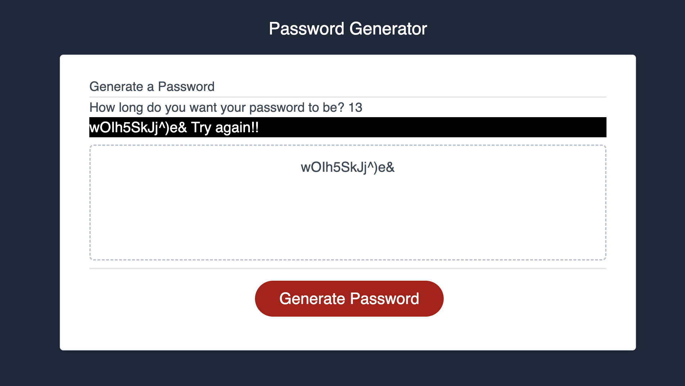

# Password Generator Starter Code

## Description

This is web application is a simple password generator that allows the user to choose the length of their password while storing the previous one in the HTML. 
This gives a simple password for anyone who needs a quick one while storing it and allows for any length needed. 
This project was focused on using java to link to the html. The most important part was using correct notations and variables to store and add characters to the password. 

## Installation

This web application can be accessed through the web or by creating a copy in your local storage with a git clone command. 

## Usage

## License 

check repository 

## Features

- Allows the user to choose the length of their password
- Displays their password in html in case they want to keep trying other lengths